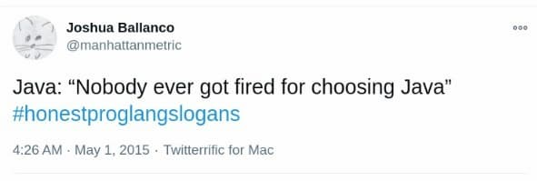
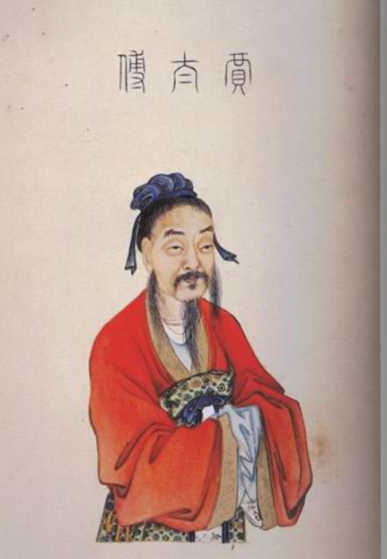

# 从资治通鉴上所学

[toc]

## 地理决定论

| Title                      | Date      | Reference        |
| -------------------------- | --------- | ---------------- |
| 026 封国该给弟弟还是儿子？ | 2020-5-27 | 熊逸讲透资治通鉴 |
|                            |           |                  |

从整个战国的历史上看，当别人都还没有认真发力的时候，地理格局这种先天因素的意义并不算特别大。谁先发力，谁就能占到优势。

魏国出现了一位英明领袖魏文侯，所以魏国很容易就实现了“战国七雄”当中最早的大国崛起。**而当竞争白热化，每个国家都开始发力之后，大家的打法很快就会趋同，一家的先进经验迅速就会被别家复制**，高端人才会被你争我抢，联盟关系注定无法长期保持。这个时候，先天差距就会格外凸显出来。这就像在一个班里，**当每个同学都悬梁刺股拼上老命的时候，能够一锤定音的就只有天赋和运气了**。

再看此时此刻的魏文侯，就算一时占尽了人和，跑在了第一位，但终归会输给天时、地利。孟子所谓“天时不如地利，地利不如人和”，在长时段里并不适用。这倒不是说“人和”的力量被夸大了，**`而是因为促成“人和”的变数实在太多，以至于它很难在长时段里保持下去。相比之下，“地利”反而可靠得多`**。

把“地利”看成影响社会发展的决定性因素，**这种观点很被儒家看不起，所以在中国没能发展起来**。

###  1. 西方-地理决定论

而在西方，从古希腊开始就不断有名人——包括亚里士多德这种大权威——支持这样的论调。到了启蒙运动时代，孟德斯鸠写出一部很大部头的《论法的精神》，用了整整一卷的篇幅——大约占到全书的1/6——论述气候如何主导了世界各民族的政治体制、宗教信仰和法律制度。气候又是由地理决定的，所以这种观点被称为“地理决定论”，在孟德斯鸠以后继续开枝散叶。

进入21世纪，美国学者贾雷德·戴蒙德的畅销书《枪炮、病菌与钢铁》风靡中国很多年。中国读者之所以更容易被这本书震撼，主要就是因为这本书把地理决定论提到了一个新高度，而地理决定论从古至今，在中国都是被打压、批判和轻蔑的对象，存在感很弱。

### 2. 东方-关系决定论

**`古代中国，尤其是儒家，相信人和人的关系才是影响社会发展的决定性的关系。`**

《资治通鉴》拼死拼活想要树立起来的最高意识形态准则——礼——就是人际关系的全套规范。礼制的总纲就是尊卑关系，也就是《资治通鉴》第一篇“臣光曰”讲的“天尊地卑，乾坤定矣。卑高已陈，贵贱位矣”。所以，维护礼制就必须自上而下，只有上行才能下效。

所以我们才会看到，**《资治通鉴》刻画魏文侯的领袖形象，罗列出来的所有事情都在围着“人和”打转，这是要让魏文侯的关系攻略成为后世君主效法的榜样**。魏文侯一会礼贤下士，一会戏精附体，各种克制，各种伪装，实在太辛苦了。

## 应然与实然问题

## 历史与历史文化

### 1. 中国的孝道为什么这么复杂

| Title                          | Date      | Reference         |
| ------------------------------ | --------- | ----------------- |
| 006 孟子怎么替不孝的匡章辩解？ | 2021-6-16 | 熊逸讲透资治通鉴² |

说回匡章带兵出征的事，《战国策》交代了事情的经过：

齐威王派匡章迎战秦国侵略军，两军对峙之后，不断有使者往来。匡章借这个机会，安排了一些齐国士兵换成秦国军人的军服和旗帜，混进了秦国军营。有侦查员向齐威王报告，说匡章带着军队进入了秦国军营，齐威王没吱声。没过多久，又有侦查员报告，说匡章带着军队投降了秦国。齐威王还是不吱声。

前线报告接二连三，都说匡章叛变了，有官员来请示说：“这么多人都做出了一模一样的报告，显然匡章真叛变了，大王您倒是赶紧派兵打他啊！”

齐威王不以为然：“匡章这不是明明白白没叛变么，为啥要打他？”

说话之间，捷报传了过来，匡章打赢了，秦国服软了。左右近臣问齐威王：“您当初是怎么笃定匡章没叛变呢？”

齐威王答道：“当初匡章的母亲得罪了匡章的父亲，被杀死埋在马厩里。我任命匡章为将军的时候，勉励他说：‘您的能力很强，一定能打赢，等您得胜归来，我一定安排好改葬您的母亲。’

但匡章说：‘我如果想改葬母亲的话，自己早就办了，只是因为我母亲得罪了我父亲，而我父亲没留下遗嘱就死了。如果父亲没交代过让我改葬母亲，而我自作主张去改葬的话，这就等于欺骗死去的父亲，我不敢这么做。’”

齐威王做总结说：“如果一个人作为儿子不欺骗死去的父亲，那么作为臣子怎么会欺骗活着的君主呢？”（《战国策·齐策一·秦假道韩魏以攻齐》）

齐威王讲的这个道理，就是“求忠臣必于孝子之家”的政治哲学。

汉朝以后，国家总是大力推广孝道，道理就在这里。**皇帝并不在乎大家是不是孝子，但很在乎大家是不是忠臣。所以我们理解孝道，不该停留在伦理层面，而要上升到政治高度才行。**一旦上升到政治高度，就会发现很多当时匪夷所思的安排背后都有必须如此的道理。

精彩点评：

> 孟子对匡章的欣赏，很大程度上是基于同情，而不是把匡章当做典范去推广。北宋的龟山先生就解释说：“章子之行，孟子非取之也，特哀其志而不与之绝耳。”  也就是说，孟子觉得匡章已经很不幸了，父暴母亡，妻离子散，大家再落井下石，还是个人么？匡章固然偏执，但是很多事的发生，也不完全在他的控制之下。  要说齐威王对这件事的理解，其实更进一步。正因为匡章家门不幸，来自家庭的温暖完全是缺失的，所以组织上如果给他一点关怀，那匡章一定是以死相报的。  齐威王信任匡章，不仅仅只是相信他的人品，战国时代礼崩乐坏，人品还值得信啊。关键是齐威王抓住了人在情感上的底层需要，给了匡章最需要的东西。

### 2. 不用现代道德来批判古人

### 3. 郭隗这个窝囊废的两种可能

| Title                             | Date       | Reference         |
| --------------------------------- | ---------- | ----------------- |
| 周末问答18·君王真的会听枕头风吗？ | 2021-10-16 | 熊逸讲透资治通鉴² |

李开任：

> 天下贤人一看，连郭隗这个窝囊废都能被燕国器重，我可比郭隗的能耐大太多了，我要是去了燕国，不知道会有多高的待遇呢！
>
> 是不是还有另一种逻辑呢？天下贤人一看，郭隗这个窝囊废都能被燕国如此器重，燕国君主可能是庸才，连最起码识别人才的能力都没有。，如果一个无能力的人被任命超高职位，公司有能力没关系没背景的人又怎么会相信公司是一家重视人才?

这种逻辑完全成立，在现实生活中也很常见。但是，对于燕昭王和相似处境里的管理者来说，这不重要，因为谁都不可能通过一个举措取悦所有人，重要的是，**只要有足够多的人遵从前一种逻辑**，也就是“连郭隗这个窝囊废都能被燕国器重，我可比郭隗的能耐大太多了，我要是去了燕国，不知道会有多高的待遇呢”，然后积极到燕国求职，这就够了。

### 4. 司马光为什么会被朱熹打败？

| Title                          | Date      | Reference         |
| ------------------------------ | --------- | ----------------- |
| 052 司马光为什么会被朱熹打败？ | 2021-8-19 | 熊逸讲透资治通鉴² |

历史总是充满偶然性，观念和著作的流传未必真的都是优胜劣汰。

**司马光之所以没能赢过朱熹，在我看来，主要因为司马光对佛学缺乏应战意识**——这种态度既不能说是错，也不能说不够高明，甚至司马光的儒学正是因此才显得醇正——虽然司马光也搞一些虚头巴脑的阴阳五行，但和朱熹比起来就显得醇正太多了。

**醇正的儒学是一门高度入世的学问，它可以是政治学，可以是社会学，甚至可以是人生哲学，但唯独不是哲学，因为它既不探究终极问题，也完全没有高来高去的抽象思辨。**这就不怪佛教东传之后，越来越多的高知都被佛教吸引了去。

学过《熊逸·佛学50讲》的同学应该都有这种感受，什么是空，什么是有，什么是无常，凡此种种，就算你不信佛，也不关心生死，至少也要承认这些问题及其解答都属于极高水平的智力活动。回头来再看儒学，哎呀，太俗了，真无聊！所以，**朱熹为了应对佛学的这种挑战，为了守卫儒家地盘，这才发明出了一整套儒家世界里的形而上学。**

形而上学是一切认知的地基。我们在日常生活当中之所以意识不到这一点，只因为我们对问题不会穷追猛打。而说到对问题的穷追猛打，今天我们都会想到这是科学的特质，但问题是，理解科学也一样需要形而上学地基。

比如拿给你一份双盲实验报告，但你还是可以追问：“我看到的数据是真实的吗？这份报告虽然捧在我的手里面，看在我的眼里面，但触觉和视觉难道不会骗我吗？插在水杯里的吸管看上去不就是断成两截了吗？”

这样追问下去的话，于是“我”是否存在，世界是否存在，一概变得可疑了，一切科学知识因此也都是基于假定而存在的——假定世界是物质实体，假定作为观察者的“我”是活生生的人。

**人很难接受不确定的状态，所以无论如何都要给知识寻找地基——普通人要找一个至上神，高知要找一套形而上学。**（可以参考《熊逸书院》58-3 | “形而上学”到底是什么？，以及58-4笛卡尔《第一哲学沉思集》（上），58-5笛卡尔《第一哲学沉思集》（下））

对于儒学而言，如果没有一套形而上学基础的话，一切命题也就只能浮在世俗层面了。比如我们追问一下：“为什么‘己所不欲，勿施于人’呢？”儒家回答：“人人如此的话，社会才能向善。”

我们再问：“为什么社会非要向善呢？社会糟糕一点的话，才方便我浑水摸鱼嘛。”儒家会说：“你的价值观有问题，要改。”

我们再问：“凭什么就是我的价值观有问题，而不是你的价值观有问题呢？”

这种问答，到最后一定停止在价值观偏好上面，只是双方各有所好，互相看不顺眼。

**当朱熹改造儒学，给儒学打造出了形而上学基础之后，儒家的传统理论才算有了坚实的地基，“善”才有了“天理”做基础，从价值偏好变成了客观事实。**尽管这种客观事实在今天看来完全站不住脚，但对于古代人来说，完全够用了。

所以朱熹体系打赢了此前所有的儒学派系，这是很有必然性的，实至名归。

但是，**正因为朱熹是知识体系上的大赢家，所以朱熹很多纯属个人偏好的东西也就跟着鸡犬升天了。**

朱熹推崇孟子，孟子的地位就一路高企；朱熹讨厌荀子和扬雄，荀子和扬雄也就越来越冷了，这绝不是因为荀子和扬雄的学术水平真的不高。看清这种现象，会给我们的读书方法提供一个很有价值的启发，那就是没必要只盯着热门书，除非你读书的目的只是想增加谈资，为社交目的服务。

## 文化语码与历史事实

### 1. 燕昭王与黄金台

| Title                                | Date     | Reference         |
| ------------------------------------ | -------- | ----------------- |
| 039 燕昭王筑宫是怎么演变成黄金台的？ | 2021-8-2 | 熊逸讲透资治通鉴² |
| 040 为什么说黄金台到底何在不重要？   | 2021-8-3 | 熊逸讲透资治通鉴² |

**先秦两汉的很多文献都围绕着“鹿台之财”大做文章，和鹿台关联的这些意象很可能就映射到了燕昭王的身上，又因为“千金市马骨”的寓言，让燕昭王的“台”和散尽千金的意象越发显得水乳交融了，这才有了从“宫”到“台”再到“黄金台”的演变。**

历史上最能给黄金台推波助澜的人物当属李白。李白自负高才，又不想走科举寻常路，而只想成为帝王师，被皇帝从民间礼聘。但现实总是不如意，所以他一而再，再而三地在诗句里吟咏黄金台。所以李白才会感慨“大道如青天，我独不得出”，然后把相关的现实人物和历史人物挨个拉出来数落，最后缅怀燕昭王，借古讽今：

李白这种热情奔放的浪漫主义诗人才不会管什么历史细节的考据呢，只要能拿来为我所用就行。

1. 燕昭王为郭隗建的“黄金台”成为经典的文化语码，以至于陈子昂在蓟北楼写的诗被后人命名为《登幽州台歌》。 
2. 鲍照诗中的黄金台可能是燕太子丹的“金台”，也可能燕昭王的“黄金台”，此后李白等诗人经常引用黄金台表达渴求伯乐之心。
3. 因后来的“宫”成为帝王专属，而“台”最适合堆放金银，孔融将“筑宫”写为“筑台”。

### 2. 苏秦与张仪

### 3. 站在观念史角度如何看待历史真相？

| Title                                                        | Date       | Reference         |
| ------------------------------------------------------------ | ---------- | ----------------- |
| [118 站在观念史角度如何看待历史真相？](https://www.dedao.cn/share/packet?packetId=q9X5M23woAqGDnBIRV99s27zWdjPvg7e) | 2021-11-19 | 熊逸讲透资治通鉴² |

以上联军伐秦和秦国的应对经过，虽然看似简单，背后却是很多学者一点点从《史记》《战国策》《战国纵横家书》等等史料当中小心拼凑出来的，时间线其实很难梳理清楚。**司马光就没做这么繁琐的考据工作了，只是根据《史记》大开大合，完全没提这一届的五国伐秦，更没提秦国割地求和的事情，而仅仅提到秦昭襄王放弃了帝号而已。**

如果我们采取***治史***的角度，那么就该站在前辈学者的肩膀上，小心翼翼地争取多破解一点历史真相。

但如果采取***观念史***的角度，那么历史真相反而没那么重要，因为，就算拿出如山铁证，结结实实推翻了《资治通鉴》的这部分记载，但无论在司马光以前还是司马光以后，古代知识分子读到的历史大体上就是《资治通鉴》所呈现的这个样子，他们所收获的历史经验和汲取的历史教训也正是从他们看到并相信的历史叙事版本里边生发出来的。

**正是他们一代代人的所见、所思、所感，而不是后人考索出来的历史真相，在他们各自的历史与人生当中发挥着真实的影响，渐次塑造出一个民族共同的历史记忆和历史想象，又在这共同的记忆与想象当中一砖一瓦地塑型出一个民族的性格，或者说国民性。然后像沉积岩一样，一代又一代人活泼泼的现实，凝结成一层又一层冷冰冰的沉积。**

而当你我这些知晓了沉积密码的后人，以温暖的手掌触摸历史岩石的横截面的时候，同样的历史记忆和历史想象才能赋予我们共情和同理的能力，使我们在冷寂中被突如其来的暖流击中。

所以，《资治通鉴》的叙事，绝不会因为失真而失去价值。

> 是一代代人的所见、所思、所感，而不是后人考索出来的历史真相，渐次塑造出一个民族共同的历史记忆和历史想象。
>
> 苏凑的故事就是一个很好的例子。苏奏给我们贡献了前医后恭、悬梁刺股、纵横牌闺这些成语，特别是给我们塑造了一个通过自己的刻苦努力，改变了命运，最后扬眉吐气，让原来轻视自己的人改变了态度的「属丝逆袭」的形象。
>
> 这些都是基于《史记》的记录，而后来出土的《战国纵横家书》证明苏秦大概率是一个间谍。虽然历史的真相已不可知，但是苏秦的故事依然会激励着中国人发奋图强，逆天改命。
>
> 更明显的例子就是《三国演义》，刘备的仁、诸葛亮的智、关羽的忠、曹操的奸、周确的护炉、桃园三结义、千里走单骑，虽然这些和真实的历史差距很大，但是通过一代用间的传颂，文学的加工，都已经成为了中国人的文化符号，塑造了中国人的性格基因。
>
> 中华文明的文化母体就是通过一代代人的所见、所思、所感，沉淀、发酵、凝结、升华而来的，是不是历史真相已经不重要了。

## 普通人要怎么读历史

### 1. 阅读史料与小说的共通性

| Title                                   | Date       | Reference         |
| --------------------------------------- | ---------- | ----------------- |
| 周末问答20·非利益相关方的意见有价值吗？ | 2021-10-30 | 熊逸讲透资治通鉴² |

司寇小陈问：

> 楚宫小臣建议张旄（máo）刺杀靳尚的事这么隐秘，怎么被别人知道的，然后记载在《战国策》里了呢？先秦为什么这么多暗杀事件？从刺杀赵盾的鉏麑到刺杀秦始皇的荆轲，那个时代的刺客出奇的多，熊老师认为原因何在？

相近的问题有很多同学在问，我这里一并回答。

人类天生的认知模式就是故事化、整体化的，随便从几个碎片就能脑补出一个完整的故事。所以历史记录也好，新闻报道也好，亲朋好友讲述亲身经历也好，任何叙述都是被主观加工过的，都免不了主观色彩，只是主观性轻重有别而已。那么不要说久远的先秦史料，即便是《明实录》这种本该是枯燥档案的史料，依然充斥着由主观性和立场因素带来的扭曲。

所以我们在看历史记载的时候，不要以为“这就是历史”，而要想到“这不是历史，而是某人站在他的角度对他所了解的或一知半解的历史做出的记载”。**阅读史料的时候，不必纠结某一件具体事情的真假，而是要通过海量的阅读去把握整个时代的风貌**。

这有点像读小说，比如当我们读过很多狄更斯的小说之后，即便明知道这些小说的内容纯属虚构，也从没看过任何一本描写狄更斯时代英国状况的历史书，但也足够领略当时英国的社会风貌。换句话说，小说里的每一件事也许都是虚构的，但所有这些事所折射出来的社会风貌一定高度逼真。

至于暗杀事件，古今中外从来都很多，春秋战国时代并不特殊。

### 2. 普通人要怎么读历史？

| Title                    | Date      | Reference         |
| ------------------------ | --------- | ----------------- |
| 130 普通人要怎么读历史？ | 2021-12-7 | 熊逸讲透资治通鉴² |

我们普通人读历史，跟历史学家读历史不大一样。**在学科越分越细的当代，历史学家要关注局部当中的局部，努力去伪存真，关注点在于“事实”。**

而普通人读历史，不妨大而化之，不去计较一个又一个的知识点，或者说不必在意一城一池的得失，**而要通过海量的阅读，在无数或真或假的历史案例当中去领悟一些可以成为宝贵经验的“道理”。**

之所以强调海量阅读，是因为一切表述、记载，都是经过主观裁剪的——也许淖齿是忠臣，被人泼了脏水，也许乐毅是个大奸大恶之辈，只不过伪装得好。但千千万万个淖齿和乐毅的事迹总不可能都是假的，只要你的阅读量够大，就可以忽略细节的失误。这就像搞统计，报上来的数据既有错的，也有假的，但只要样本数够大，一城一地的得与失，真与假，也就不是很有所谓了。

### 3. 历史经验为什么宝贵

| Title                    | Date      | Reference         |
| ------------------------ | --------- | ----------------- |
| 130 普通人要怎么读历史？ | 2021-12-7 | 熊逸讲透资治通鉴² |

我们从齐襄王的即位可以看出乐毅的一大失策，那就是乐毅明明以闪电战的打法首先攻破齐都临淄，接下来又几乎攻占了齐国全境，怎么就没能第一时间在临淄拥立一位新的齐王呢？这一招也算是古今中外的历史上各种侵略军的惯用手段了，前边讲过秦国伐蜀就是这个套路。**历史经验之所以宝贵，因为它是无数前人拿身家性命去试错才试出来的，每一个经验点的背后可能都是无数个行差踏错的生命**。

### 4. 时间线与因果

| Title                          | Date       | Reference         |
| ------------------------------ | ---------- | ----------------- |
| 041 燕昭王纳贤为什么会被夸大？ | 2018-12-14 | 熊逸·唐诗必修50讲 |

燕昭王当初“千金市马骨”，天下人才纷至沓来，这个纷至沓来是有个过程的，并不是说在燕昭王招贤的当年就全部到位了。比如乐毅，《史记·乐毅列传》就明确说他是在赵国沙丘之乱以后转投魏国，又作为魏昭王的使者访问燕国，这才被燕昭王留下来的。时间线这样一做梳理，就能知道乐毅到燕国的时间最早也早不过燕昭王即位的第17年。

这就意味着，天下人才被吸引到燕国有一个长达多年的过程，并不是一呼百应，一蹴而就的。（查揆《筼谷文钞》卷2《与赵琴士徵君书》）。

们普通读者就很容易陷入这样的思路，因为从《资治通鉴》的记载来看，天下人才的纷至沓来和燕昭王的“千金市马骨”分明就是前后脚的事情，否则的话，郭隗享了十几二十年的福，才有外国人才投奔燕国，这到底归不归功于郭隗本人和“千金市马骨”的策略可就说不清了。

我在《熊逸书院》谈过《左传》的写法。《左传》里的第一个大故事“郑伯克段于鄢”被收进了今天的中学语文课本，你应该还有印象。绵延几十年的事情被浓缩在短短的千字篇幅里，既没有一处闲笔，也没有半句废话，既没有证据断链，也没有逻辑缺环，就这么环环相扣，脉络井然。

**如果我们不是停下来有意识地梳理一下它的时间线的话，就很容易不自觉地陷入我们天生的故事化的思维模式里去。这是我们读历史，乃至理解社会，特别需要警觉的一点。**

## 哇哈！

### 1. 理性人与大丈夫

| Title                                      | Date      | Reference         |
| ------------------------------------------ | --------- | ----------------- |
| 周末问答 7 ·司马光会如何评价“理性人”概念？ | 2021-7-31 | 熊逸讲透资治通鉴² |

墨盐同学问：

> 大丈夫认:“ 富贵不能淫，贫贱不能移……”。 司马光如果知道了现代经济学有个“理性人”的概念，不知该做如何评价。

你的问题里边藏着一个特别普遍的误解，很值得仔细澄清一下。

先说结论：儒家的评价标准和“理性人”并不矛盾，因为它们分别属于不同的范畴，基本不搭界。

在儒家标准里，“富贵不能淫，贫贱不能移，威武不能屈”，这是“大丈夫”的标准，是道德上的高标准。儒家认为，人应该向着这个标准努力，但同时也明白，这个标准实在太高，真够得着的人不会太多。

我们需要注意的是，它是一个道德标准，而所有的道德标准都属于**应然范畴**。

“理性人”就不一样了，并没有哪个经济学家会主张人“应该”努力提升自我，以期成为“理性人”。所以“理性人”的概念并不属于应然范畴，没法和“大丈夫”去比较，这就像“男人”和“好人”这两个概念没法比较一样。

那么新问题来了：“理性人”看来属于实然范畴，但它所表达的到底是不是事实呢？人真的是理性的吗？或者说经济学家所谓的“理性人”在现实世界里真的存在吗？

答案很明确：**人并不理性，理性仅占人的思维模式的很小一部分，经济学家所谓的“理性人”在现实世界里从来都不存在。**

既然不存在，这个概念的意义到底何在呢？

答案也很明确：这就是一个假设值，把要素简化之后才方便做分析，推结论，建模型。

真实的人当然复杂得多，真实的社会同样复杂得多，所以，基于“理性人”这个假设值而得出的结论，建立的模型，对我们而言具有参考价值，但也仅有参考价值，绝不会像物理法则那样放之四海而皆准。

在东方明珠塔尖上扔一个球，和在比萨斜塔的最高处扔一个球，重力加速度分毫不差，但一个基于“理性人”假设而得出的经济学模型，在中国说得通，未必见得在意大利还能说得通，就算同在中国，在上海说得通，未必见得在大别山区还能说得通。

但即便是经济学领域里的知名专家，也会不小心陷进语词的泥潭，去纠缠“理性人”在事实上到底成不成立，所以有人提出人有利他行为，尤其是舍己助人的行为，这显然不理性，还有人提出“理性人”这个概念应该被修正，人的“理性”只是“有限理性”。

我印象中，十几年前的经济学文章里经常争论这个话题，当时把我也给绕进去了，过后一想，其实回归经典，就在凯恩斯的《就业、利息和货币通论》里边明明白白地说过：

“不论是个人事务，还是在政治和经济问题中，影响着将来人的决策都不可能单纯取决于精确的数学期望值，因为，进行这种计算的基础并不存在。推动社会的车轮运行的正是我们内在的进行活动的冲动，而我们的理智则在我们能力所及的范围内，在能计算的时候，加以计算，以便做出最好的选择；但以动机而论，我们的理智却往往退回到依赖于我们的兴致、感情和机缘的地步。”（高鸿业译，商务印书馆，1999年，第166页）

凯恩斯在这段话之前，罗列了很多“非理性”的情况，简直要让读者怀疑人到底还有没有理性存在了，所以凯恩斯才会找补一句，说大家不要因此就觉得心理冲动决定一切，实际情况并没有那么极端，人还是有理性的，尤其是在考虑长远投资的时候。

显然，凯恩斯早就把理性问题说得清清楚楚了，几乎不需要做任何补充了，但不知道为什么，大家竟然都忘记了，这才把水越搅越浑。

今天我们回顾那些争论，首先就会疑惑的是：为什么利他行为会被拿出来跟“理性人”唱反调呢？一位英雄人物既可以凭着一腔热血，还没来得及动用理性就慷慨赴死，但也可以在经过了深思熟虑之后，决定牺牲小我，保全大家——这样的从容就义明明就是理性的产物嘛。

要解答这个问题，我们就要追溯到比凯恩斯更古老的人物：亚当·斯密。

斯密的《国富论》提出了那只著名的“看不见的手”，大意是说人人用心谋求私利，就往往会在一只“看不见的手”的操控下促进了公共利益。它还有一个天然配对的命题，是一句西方谚语：“通往地狱之路是由善意铺就的”，哈耶克很喜欢引用这句话。

那么，一边是私心反而促进公益，一边是公心往往事与愿违，一个应然命题也就呼之欲出了：扫好自家门前雪，莫管他人瓦上霜，只有这样，才会你好我好大家好。如果有谁真的一生奉行这种理念，那么他的形象很容易刻画：他是理性而自利的。

看，这就和“理性人”挂上了钩，把“理性人”的“理性”导向了“自利”的一途，也就是说，在一个“理性人”的身上，理性的意义就是谋求私利，并且最大限度地谋求私利。

这里有两点需要格外留意：一是所谓自利也好，谋求私利也好，原本并不相当于道德意义上的那个贬义词“自私”；二是在《国富论》原著当中，斯密非常审慎地避免了全称判断，并没有说私利“必然”促成公益，而仅仅是说“他追求自己的利益，往往使他能比在真正出于本意的情况下更有效地促进社会的利益”。但很遗憾，这两点后来不但经常被普通读者忽略，竟然也会被专业高手忽略，于是牵扯出不小的麻烦。

先看第一点，**经济学意义上的“自利”不同于道德层面上的“自私自利”**，这并不难理解，就像绝大多数的打工者，打工就是为了赚钱，这既不高尚，也不卑鄙，和道德无关，如果老板拖欠工资，打工者大可以大大方方地去要，老板没道理反过来质问打工者：“你们怎么可以这样自私！为什么就没有一丁点的奉献精神！”

但是，我们毕竟是小群体抱团为生的原始人的后代，基因编码里深深烙印着小群体里讲人情的行为模式，所以即便被老板拖欠工资，或者在职场上受到了任何不公平的待遇，我们其实都很难跨越人情的障碍，大大方方地争取自己的权益。

那么也就不难理解，无关于道德的“自利”概念很容易跟道德层面上的“自私自利”的概念发生混淆，连带着就让“理性人”变得面目可憎了，被儒家标准里的“大丈夫”甩了十八条街。

再者，**利他不但和自利并不矛盾，和理性也不矛盾。**人类作为群居动物，如果只自利，不利他，注定活不过莽荒时代，没有哪个同伴会在围猎猛兽的时候安心把自己的后背交给一个纯粹的利己主义者，这就意味着，如果人类当中真的出现过纯粹的利己主义者的话，早就被生存竞争淘汰掉了，他们的基因不可能传到今天。

我们只是进入现代化了，从小部落转入大都会了，这才对利他主义产生了疑惑，觉得贯彻利他主义需要逆着天性，需要伟大的人格和高尚的道德感召，否则就不可能。

再看第二点，在《国富论》的原著当中，亚当·斯密非常审慎地避免了全称判断——这很理性，但读者往往并不会同样理性地做出理解，而是很容易忽略限定语，不自觉地就往全称判断的方向理解。反驳全称判断从来都很简单，只需要举出一个反例就够。

如果斯密真的做出了全称判断的话，那么反例很容易找，博弈论里的囚徒困境就是。两名囚徒分别做出了高度理性的判断，目的是个人利益最大化，结果却并没有让双方利益最大化，可见“看不见的手”并不是总能起到作用。

但这真的驳得了亚当·斯密了吗？显然并没有。

博弈论作为一个学科虽然很新，但博弈论的想法不但古已有之，而且自然而然。凯恩斯在《就业、利息和货币通论》里就拿当时报纸上的选美投票来比喻投资，说报纸给出的规则是，参与者要从100张美女照片当中选出最漂亮的6张，如果有谁选出来的6张照片最接近于全部参与者投票最多的6张，那么他就是这场竞赛的赢家。

但这样一来，参赛者如果想赢，要选的就不会是自己认为最漂亮的照片，而是会去猜测大多数人的选择倾向。这就是理性人的理性选择，但这既无关于道德，也不必然促进公共利益的增加，甚至都不是个人审美偏好的真实表达，票选的结果大概率上并不会是所有参赛者公认的美女。

最后总结一下：首先，“大丈夫”是一个应然命题，但“理性人”并不是，所以两者并不存在可比性，谈不上谁高尚，谁卑鄙；其次，“理性人”仅仅是个假设值，并不符合事实，但有一些经济学家不知道因为什么，从实然角度修正或者抨击“理性人”的概念，把水搅浑了；再其次，“理性人”这个假设值并不否定利他主义，只因为遭受了误解，这才跟利他主义打了好多年的架。

1. 儒家关于“大丈夫”的标准，是个道德标准，属于应然范畴。 
2. 经济学家所谓的“理性人”在现实世界里从来都不存在，理性仅占人的思维模式的很小一部分。 
3. 经济学意义上的“自利”，不同于道德层面上的“自私自利”，利他不但和自利并不矛盾，和理性也不矛盾。

留言精选

其实经济学家并没有幼稚到相信现实的人像他们假设的那样具有完全理性，但他们仍然坚持这个假设。2007年诺贝尔经济学奖得主、芝加哥大学教授Roger Myerson提出了三个理由：  

-  首先，在没有更好的其他可选择的理论的时候，接受理性人假设是一个退而求其次的办法。非理性假设可以描述许多现象，但不可能建立起一个有分析能力的理论体系。  

-  其次，从社会演化角度看，尽管人不是每时每刻都是理性的，但如果一个人长期不理性，ta就很难生存。换一句大白话就是——社会会教你如何做人。  

- 第三，社会科学的目的不仅是要预测人是如何行为的，还要分析社会制度/政策/改革的优劣。如果假定人都是不理性的，什么社会弊端都可以归结到人的问题，那么制度就没有办法设计，人类也就没有办法改进了。  

  提倡理性人的古典经济学家如果能穿越到21世纪，他们一定会惊讶于「行为经济学派」的大行其道。  行为经济学承认人并非完全理性，我们有很多与生俱来的缺陷，我们易于冲动，难以自控，时常懊悔，有时也会欺骗，市场经济也不是完美的。  承认这一点，不会让我们变得自暴自弃，而是会让我们变得更加谦卑和诚实。

###  2. Nobody ever got fired for choosing Java

[Slack 是一个非常优秀的团队通信协作软件](https://www.ruanyifeng.com/blog/2020/12/weekly-issue-137.html)，它在全世界有众多的用户，去年(2019)的收入是8.33亿美元。上周(2020)，它把自己卖给了 Salesforce，售价高达277亿美元（约1800亿人民币）。从此，Slack 不再作为独立公司运行，而成为 Salesforce 的一个部门。

这其实是一件有点奇怪的事情。Slack 的发展势头非常好，疫情期间正流行远程办公，它却在这时选择不当独脚兽了，套现离场，这是为什么？[最主要的原因](https://mattstoller.substack.com/p/an-economy-of-godzillas-salesforce)大概是，它有一个强劲的对手 Microsoft Teams。这是微软模仿 Slack 推出的团队协作软件，可以跟 Office 绑在一起使用，Slack 感到极大的竞争压力。

以前有一种说法，第一线程序员可以自由选择软件工具，然后"自下而上"推动整个企业采用，我也曾经信以为真。但是，这种想法是不现实的， **第一线程序员影响不了技术选型和采购决策，而决策者害怕承担决策错误的责任。** 你选择了一个小软件，万一没有很好地支持业务，或者软件本身有缺陷，你是要负责的。

Teams 是2016年10月发布的，到现在的四年间，用户从零变成了1.15亿。同样这段时间，Slack 的用户从400万增加到1200万。也就是说，Teams 的增长速度大概是 Slack 的十几倍！

这其实很容易理解。企业软件的背后有没有巨头支持，销售结果是完全不一样的。两个软件的功能完全相同，一家出自创业公司，另一家背后是微软，你说企业会选择谁的产品？

**软件业有一句名言，"没人因为选择 Java 而被开除"。** 选择有大公司支持的技术，可以得到某种保证。那些技术可以不先进、不完美，甚至很乏味，但是它能保证得到积极维护和开发，具有庞大的生态系统和社区，并已经在大型业务环境经受了实战考验。企业就喜欢这样的技术，可以减少技术选型的风险，万一出事就不是决策者的责任。

微软在 Teams 上投入重金，并且还有庞大的销售部门在推销，Slack 怎么可能竞争得过！并非巧合的是，Slack 选择卖身的 Salesforces，技术能力也许不属于世界最强之列，但一定是世界上销售能力最强的软件公司之一。

顺便说一下，前端的技术选型也是如此。企业选择不知名的 JS 框架是有风险的，可以预言，最终赢的还是 React。它是世界排名第一的前端框架，背后有 Facebook 的支持，所以"没人因为选择 React 而被开除"。

## 古代的女人

### 1. 烽火戏诸侯与红颜祸水之说

| Title                             | Date       | Reference         |
| --------------------------------- | ---------- | ----------------- |
| 周末问答18·君王真的会听枕头风吗？ | 2021-10-16 | 熊逸讲透资治通鉴² |

司寇小陈：

> 《战国策》记载这段郑袖蛊惑楚怀王，会不会又像烽火戏诸侯一样，是古代史官为了推卸责任，把坏事放到了女性身上？还有，古代君王的妻妾们在政坛能发挥多大作用？真能像郑袖这样吹吹枕边风，君王就言听计从了？君王为什么会听从呢？

古代社会既可以说是父权制的社会，也可以说是男权社会，男人主导一切，并且掌握全部的话语权，女人只是男人的**附属物**，**而不是和男人对等的人**，**根本不具备背锅的资格**。所以，把责任推卸在女人身上这种说法，我觉得并不成立。

当史官描写红颜祸水的时候，应该就像老人家提醒孩子五颜六色的蘑菇有毒，在采蘑菇的时候必须提起十二分的警觉一样。如果有哪个孩子受了毒蘑菇美丽外表的蛊惑，不幸中了毒，大家当然不可能为毒蘑菇说好话，但无论怎么宣扬毒蘑菇的毒性，怎么夸大其词，**都不是为了把毒死人的责任推卸到毒蘑菇身上，而只是为了唤起人们必要的警觉而已**。

古人常常说起酒色误人，色和酒是被归为一类的，埋怨美女就像埋怨美酒一样。**如果一定要说史官把责任推卸到女人头上的话，那么这种推卸，就像史官记载了一个喝酒误事的人的一生，然后把责任推卸到酒的头上一样**。

至于古代君王的妻妾们在政坛能发挥多大作用，是不是真能像郑袖这样吹吹枕边风，君王就言听计从了呢？答案可以很简单：政治结构可以变，风俗习惯可以变，婚姻制度可以变，但人性至少在肉眼可见的历史当中从来没变。罗密欧与朱丽叶的感情戏，既会在平民百姓的世界里反复上演，也会在帝王将相的世界里反复上演。

古人把人类的核心欲望归结为“饮食男女”，深究一下的话，“饮食男女”只是手段，不是目的，真正的目的是繁殖，或者说是基因的自我复制。当这样一种生命深层的欲望被激发起来之后，人的行为就被扫荡一切的洪荒之力所支配了，**脆弱的理智简直不堪一击**。

唯一的解药就是由**时间带来的性倦怠**——以今天的人类学研究来说，两性之间会有1~2年的如胶似漆、你侬我侬，然后就会产生性倦怠，罗密欧觉得朱丽叶的皮肤有点黑，距离“肤如凝脂”还有明显差距，朱丽叶发现罗密欧的身材有点走样，可不如正当红的流量明星那么顺眼。等看出对方的毛病了，理智也就开始恢复正常了。

古代国王和今天的普通男人不同，女人无限量供给，一生之中会陷入一场又一场的鬼迷心窍的男欢女爱，在这种状态下听信枕边风实在再正常不过了嘛。

### 2. 宣太后（芈月）

| Title                              | Date      | Reference         |
| ---------------------------------- | --------- | ----------------- |
| 073 宣太后是如何首次亮相的？       | 2021-9-17 | 熊逸讲透资治通鉴² |
| 072 为什么说魏冉的系列安排很高明？ | 2021-9-16 | 熊逸讲透资治通鉴² |

> 周赧王八年（前307年），秦昭襄王刚刚即位的那一年，楚怀王非但没在秦国的王位争夺战上用心，反而趁着秦国政权不稳，无暇他顾，韩国新受重创的这个窗口期，北上去打韩国，围攻韩国重镇雍氏。韩国派诸多使臣都未能见到宣太后，只有尚靳一番话打动了宣太后，因此见到了芈月。

[宣太后](https://baike.baidu.com/item/%E5%AE%A3%E5%A4%AA%E5%90%8E/10495265?fr=aladdin)芈月听到汇报，亲自召见尚靳，说出了一番很惊人的道理“我侍奉先王的时候，先王每次把大腿压在我身上，我都被压得吃不消，但他把全身都压在我身上的时候，我反而感觉不出压力了。

为什么呢，因为在这种时候我很享受呗。如今要我们救援韩国，兵力少了不管用，大军出动的话，日费千金，却不能使我得到一丁点的享受啊。”

> 宣太后谓尚子曰：“妾事先王也，先王以其髀**[bì]**加妾之身，妾困不疲也；尽置其身妾之上，而妾弗重也，何也？以其少有利焉。今佐韩，兵不众，粮不多，则不足以救韩。夫救韩之危，日费千金，独不可使妾少有利焉。”
>
> **尚靳**:
>
> **秦昭襄王**：
>
> **魏冉**：

宣太后到底为什么不肯出兵呢？《史记》说宣太后是楚国人，不愿意帮着韩国打楚国，而《战国策》这里的意思，是说宣太后只是在算账，暗示尚靳回去向领导请示，必须许给秦国足够大的好处，秦国才肯帮这个忙。搞外交如同做生意，不做赔本的买卖。

这就引出了两个问题：一是宣太后到底有没有把账算对，二是堂堂大国太后，在外国使节面前怎么会拿夫妻生活打比方呢，这是不是过于不成体统了？

算账的事情，马上就见分晓。体统问题，确实是个大问题，也难怪《资治通鉴》对这件事只字不提，甚至连雍氏之役这么大的一件事全部删除。

不只司马光，太多人面对这样的语言都感觉难以置信，只能怀疑这纯属后人对秦国的抹黑。但他们忘了，宣太后是楚国女子嫁入秦国，而楚国也好，秦国也好，都不属于根正苗红的华夏文明。

不过在当时当地，尚靳很可能被惊得目瞪口呆，然后赶忙往回跑，把宣太后的夫妻生活秘史向韩襄王做汇报。这毕竟算是有了初步的外交成果，人家**宣太后已经漫天要价了，就看韩襄王这边该怎么坐地还钱。**但韩襄王实在还不起价，因为宣太后拖得起，韩襄王可拖不起。

> 宣太后的出场，的确是语惊四座，尺度大的吓人。但是我认为，可能有下面两个原因:
>
> 首先，秦国地处西陲，受戎狄文化影1响较大，故不似中原国家那般重视礼教。楚国地处南蛮之地，同祥也对中原礼法嘻之以鼻。宣太后作为楚国的公主，嫁到了秦国，她深受这两个[蛮夷」国家文悦的影响，能说出这样「大尺度」的话，也不用太惊讶。
>
> 其次，宣太后取得了执政权，又有自己的弟弟魏冉做帮手，在秦国国内已经是权倾朝野了，因此，说话也就无所顾忌。
>
> 其实，宣太后的这种「大尺度」，在《史记·匈奴列传》里还有记录，这次她可是自己「亲自上场」了。
>
> 《史记.匈奴列传》记载:“秦昭王时，义渠戎王与宣太后乱，有二子。宣太后诈而杀义渠戎王于甘泉，遂起兵伐残义渠。"
>
> 宣太后与义渠戎王私通，还生了两个小子，但是，她最后又诱杀了义渠戒王，并趁义渠戎人没有任何戒备的情况下，迅速派兵机寐打败他们。从此，秦国再无后顾之忧。如果秦国硬滋硬地对义渠用兵，代价—定非常大，而凭借宣太后诱杀情夫，秦国轻松地灭了义渠。

## 旅行的意义

| Title                                  | Date       | Reference         |
| -------------------------------------- | ---------- | ----------------- |
| 01 杜甫《望岳》\| 青春豪情，一览众山小 | 2018-11-25 | 熊逸·唐诗必修50讲 |

旅行的意义到底是什么呢？

### 1. 暂时从旧关系中解脱出来

**第一点就是摆脱旧环境带来的负面联想**，因为在你深深受过伤的地方，一草一木都有可能让你触绪伤怀。

### 2. 暂时摆脱工具属性

**第二点是帮你摆脱工具意识**，因为在熟悉的场景里，你看到的一切或多或少都会工具化。

比如当你站在十字路口，随便看看或者哪怕不看，你都知道这一条路是通往公司的，要在什么时间坐车才能避开早晚高峰；另一条路是美食街，下班的时候可以来这里放松一下，填饱肚子。你还知道哪一栋楼是医院，挂号要从哪个门进，哪一路公交车能把你载到哪个朋友的家……

一切对你来说都是达成某个具体目标的工具。

**一个人如果常年生活在工具化的心态里，一定会面目可憎、一脸俗气，连他自己都觉得乏味**。这时候，就有必要换到一个陌生的场景。

即便那里也只是一座普普通通的城市，没有任何优美的风景，但也会让人产生审美的快感，因为陌生的环境总会让人对生活拉开审美距离。

当你站在新的十字路口上，你并不知道每一条路通往何方，也并不急着赶路。这就意味着，这个路口对你来说并不是通往某个目标的工具。这样的话，就算走错了路你也不会生气，只会用悠然的心态欣赏街景。步子快一点或慢一点都无妨，因为没有了目标，就不需要执行力；而不需要执行力，当然就不需要苛刻的时间表。

*今天的很多人之所以把旅行搞得很疲倦，也不觉得有任何审美体验，就是因为不懂得这个道理，没有在时间和空间上让自己和环境拉开足够的审美距离*。

我们知道距离产生美。你可以从这句话里试着理解一个生活中的场景：当男人成功迎娶了爱慕多年的女神，可感情往往会由浓转淡，这仅仅是因为喜新厌旧的天性吗？并不全是。***爱慕可以帮人拉开审美距离，而婚姻生活是工具化的。工具化一定意味着零距离，零距离一定会让美感消失***。

## 群居动物特性

### 1. 态度与事实

| Title                            | Date      | Reference         |
| -------------------------------- | --------- | ----------------- |
| **034 为什么说胡适误解了屈原？** | 2021-7-26 | 熊逸讲透资治通鉴² |

屈原之所以能够担当如此重任，除了贵族血统之外，《史记》对他还有12个字的总括，说他“**博闻强志，明于治乱，娴于辞令**”，意思是说，屈原的学识很丰富，记忆力超群，问他什么他都有的说，他对管理学的研究很深很透，明白国家兴亡的关键，口才和文采还特别好。

屈原的同僚嫉贤妒能，在楚怀王面前进谗言，说大王安排屈原制定新法，这是大家都知道的，但每次一有新法公布，屈原这小子就夸口说这事全都靠他，换谁都做不来。这种话正是谗言的经典模式：焦点并不放在事实上，而是放在当事人的态度上。**人类天生对态度比对事实敏感得多，因为态度最能表现群体生活当中的等级序列。**

在屈原的位置上，被默认的“正确”态度是：自己只是一名执行者，这种简单劳动换谁都能胜任，真正的功劳只应当属于天纵英明的领导。如果法令颁布之后效果不佳呢？那也简单，都怪自己执行不力，把一部好经念歪了，恳请领导给自己一个改过自新的机会。

### 2. 国王无谬论

| Title                                  | Date      | Reference         |
| -------------------------------------- | --------- | ----------------- |
| **025 为什么说替罪羊是一种政治智慧？** | 2021-7-13 | 熊逸讲透资治通鉴² |
| **026 谁是齐宣王伐燕时的帮手？**       | 2021-7-14 | 熊逸讲透资治通鉴² |

中西方不约而同发展出的无谬性

**在人类天然形成的群居模式里，首领只有够强，才能够形成向心力，而一旦他变弱了，那么，无论道德水平有多高，离心离德总会自然而然地发生。**犯错就是变弱的表现，所以领导者是不能犯错的，换言之，有德有位的圣人确实应该无所不知，无所不能，半人半神，神人同体。

无论他是不是这样的存在，至少要让大家相信他是这样一种存在。所以汉朝以后，[贾谊](https://baike.baidu.com/item/%E8%B4%BE%E8%B0%8A/50286?fr=aladdin)提出了“**阶级**”概念，要让皇帝和老百姓拉开距离，所以相权才变得格外重要，国家运转一旦出了错，宰相或者其他具有宰相资格，位高权重的人，就会成为替罪羊，皇帝的权威无论如何都不能受到丝毫减损。

皇帝就算有错，并且承认错误，最要承认的也应该是“失察”一类的错误，检讨自己被奸臣蒙蔽了双眼。这样一种政治智慧来之不易，因为替罪羊原本应该是最高统治者本人，这就是蒙昧时代里的酋长也好，首领也好，王也好，所必须承担的风险。

而替罪羊角色下移，最高统治者权威无损的策略，在东方和西方不约而同都出现了，西方甚至还搞出了专有名词“教皇无谬性”和“国王无谬性”，这方面的内容，我在《熊逸书院》讲霍布斯《利维坦》和贾谊《新书》的内容里详细讲过。

> 回到齐宣王的问题上，这个时期的战国列强已经纷纷走向集权了，统治者不能示弱。所以打肿脸之后必须充胖子，打落牙齿要往肚里吞。
>
> 当我们读历史，读到这些内容的时候，直觉上总会在个人道德的层面上生出反感，殊不知如果把孟老夫子安置在齐宣王的位置，齐国早就撑不到如今了。
>
> 当然，对于这样的结果，孟子倒也不会介怀，反正尽人事，听天命也就是了。用今天的话说，就是“但行好事，莫问前程”。
>
> 孟子的另一个问题是，他本人是高知，能和国君近距离相处，期待的是一个君子型的统治者，是人而不是神，知错就改，而他没想到群氓想要的不是人，而是神，不是知错就改的人，而是不会犯错的神。

埃及法老

最高统治者威严无损的策略，在古代埃及就已经执行的炉火纯青了，法老掌握全国的军政、司法、宗教大权，其意志就是法律，相比之下，法老的权力比中国的最高统治者还要大。

因此，法老需要在各个方面都煞费苦心，维持往自己半人半神的形象。比如王冠，头饰，权杖，眼膜蛇，一看就让人心生数畏。当然，法老还要着力打造自己的陵寝金字塔，以及创篮造一个关于神8泪咒的传说。

可以说，就制造神秘主义的手法来说，法老真是登峰造极，而且，效果确实不错。当时那种没有成熟管理体系但是古埃及延续了接近5000年，如果不是气候变迁，统治还将继续一段时间。

谎报战功

那个时代里，统治者必须确保自己的圣君形象，所以打仗必须战无不胜。就算自己做错了事，被外国指责，那也得把自己打扮成受害者形象，反正无论如何都不能理亏，也不能栽跟头。但人生哪有那么顺风顺水、万事如意呢？如果不幸真的打了败仗，或者在外交上出现了重大失误，怎么办呢？

对外的话，该怎么办就怎么办，没办法；但对内的话，很简单，只要把失败打扮成胜利就可以了，反正古代老百姓信息闭塞，即便是参战的普通军人，每个人也只知道自己身边的局部胜负，而局部的失败和整场战役的胜利一点都不矛盾，所以老百姓只要敲锣打鼓庆祝胜利就好了。

这个貌似早就过了有效期的老药方，其实有着惊人的生命力，我们只要看看1967年以色列和阿拉伯国家打的那场“六日战争”（[Six-Day War](https://en.wikipedia.org/wiki/Six-Day_War)）。埃及明明才一交火就被打得一败涂地，但埃及总统纳赛尔偏偏就敢颠倒黑白，安排官媒报道喜人战果。

要不是以色列后来都打到了开罗郊区，战况实在没法瞒得住的话，那么埃及人和约旦、叙利亚的阿拉伯同胞们依然沉浸在胜利的喜悦当中呢。

难道纳赛尔就不怕纸里包不住火吗？

无论怕或不怕，他的反应其实是管理学上的一个经典模式。试想一下，如果一开始就实话实说，大概率上会诱发的结果就是人心惶惶，士气低落，再也没机会翻盘了。而如果颠倒黑白，硬是把失败说成胜利，马上士气高涨，民心可用，还有一战之力，也许就翻盘了呢。而一旦真的翻了盘，当初的假话也就自然变成了真的，不会有人再去追究了。

**所以历史上谎报战功的事情层出不穷，不仅最高统治者会谎报，就连前线指挥官也会谎报。**

那么假想一下：如果皇帝看出了将军在谎报战功，会不会龙颜大怒，严加惩治呢？

有时候会，但也有时候非但不会，反而将错就错。在后一种情况下，将军只要足够精明，判断出皇帝这时候很需要一场胜利，那就可以壮起胆子撒谎。皇帝则会在心领神会之下嘉奖有功将士，甚至还会安排普天同庆的戏码，因为在人心不稳的时节，只有这样做，才会迅速提升凝聚力，维护政权的稳定。

> 所以我们读历史就该格外警惕。就拿齐国和中山国来说吧，在伐燕这件事上，双方非但不是敌对关系，反而近乎于盟国，而假如没有中山国墓葬出土的话，我们就会相信了齐国的版本；假如没有孟子的记载，齐宣王的形象恐怕就要相当的英明神武了；假如我们是中山国的后人，手边的记载只有青铜器上的那些铭文，就不会以为这件丰功伟绩当中竟然还有齐国的份了。

### 3. 职场核心能力

| Title                                   | Date       | Reference         |
| --------------------------------------- | ---------- | ----------------- |
| 周末问答20·非利益相关方的意见有价值吗？ | 2021-10-30 | 熊逸讲透资治通鉴² |

陈熙竹问：

> 血统高贵、才华出众、领导赏识这三大优势终究抵不过小人谗言。是否可以说只要是位高权重者，必然第一位的能力就是处理人际关系？

我想陈熙竹同学的问题是从屈原的生平生发出来的。

屈原的情况有点特殊，做的就是得罪人的事。这就像你的单位里边，大领导特别倚重一名副手，让他成天制定规章制度，那么在同事们看起来，今天规定上班抽烟要罚款，明天规定在食堂吃午餐浪费要罚款，后天又规定请病假必须提供医院开具的正规假条，还要盖医院的公章……这么一来，大家肯定会有情绪。如果再眼睁睁看这名副手又升职加薪了，备受领导器重，大家肯定气不打一处来。

如果抛开具体情境，抽象一点，宽泛一点来谈谈这个问题的话，那么在我看来，无论一个人是不是位高权重，**只要进入职场，处理人际关系的能力基本等于识别并把握核心关系的能力。只要拥有这个能力，那么人缘再差都不要紧，因为绝大多数的人际关系都是无效关系，只能提供情绪价值**。

而如果缺乏这种能力，那么除非下定决心舒舒服服躺平混日子，否则人缘再好也没太大用处。年轻人很容易从学生时代的朋友关系，来理解职场上的同事关系和历史上的同僚关系，这就很容易造成认知错位。

### 4. 什么是专制

长平之战以后，秦国继续伐赵，结果主帅郑安平被赵国军队围攻，情势危急之下竟然带着2万军队向赵国投降了。当初任命郑安平的是秦国总理范雎，那么依照秦国法律，范雎要和郑安平同罪受罚，都要被“收三族”，全家人一勺烩。

秦昭襄王的办法是：出台一项法令，说无论是谁，只要敢提一句郑安平的事情，就跟郑安平同罪。

这就叫言出法随，秦昭襄王就是能这么耍混。同时，他还用心赐给范雎好吃好喝，安抚范雎的情绪。（《史记·范雎蔡泽列传》）这就像今天的私企一样，普通员工也许会被老板颐指气使，犯点小错就被开除，但明星员工反而会被老板各种巴结，各种纵容。

**当初商鞅变法，虽然提出了“刑无等级”的法律思想，虽然也确实做到了王子犯法与庶民同罪，但法律是为国君服务的，国君本人并不受法律约束。**这就叫“法治”，“治病救人”的“治”，而现代社会讲的“法制”是“制度”的“制”，两者完全不是一回事。

这就意味着君主虽然平时可以垂拱而治，听任司法程序按部就班，自动运行，而一旦他对司法结果不满意，只要一句话就能推翻重来。我在《熊逸说苏轼》那门课程里讲过，苏轼遭遇的乌台诗案，案件的整个审理过程彰显出非凡的程序正义，让人深深惊叹于宋朝司法的文明程度。然而到了最后，宋神宗对判决结果不满意，只要轻飘飘一句话就能给苏轼重新量刑。

所谓中央集权，君主专制，并不是说君主事必躬亲，每天都要批几百个折子——事实上，君主想偷懒的时候其实也可以偷懒，想垂拱而治的时候也可以垂拱而治，但关键在于，**君主只要想干涉一下什么，马上就能言出法随，推翻一切。**

### 5. 鄙视链及其存在的意义

| Title                          | Date      | Reference         |
| ------------------------------ | --------- | ----------------- |
| 070 怎么用最小的代价移风易俗？ | 2021-9-14 | 熊逸讲透资治通鉴² |
|                                |           |                   |

胡服骑射的难点还跟歧视有关。

人类作为群居动物，社会生活的方方面面都很容易形成鄙视链，因此歧视无处不在。

也正因为我们可以在某些方面歧视别人，这才产生了**尊严感**和**自信感**。

比如我有自信在“得到”做好这门课，这份自信一定是从比较当中来的，是因为我相信我在这个领域的水平绝对超过村口的张木匠、卖豆花的王太太和算命的老赵。他们如果想跟我竞争这个差事，我只会嗤之以鼻。

在传统社会结构里，等级秩序还要简单很多，比如“士农工商”，这就是一个等级序列，再比如科层制的官僚机构，这同样是个等级序列。在等级序列当中，**任何一个等级当中的人只要往下看，就能够获得尊严和自信，人生才能过得精神饱满**。但是，任何一个等级序列总会有最低的一级，往下一看，空无一人，这可怎么办呢？

通常有3条路可走：

- 一是**挑剔本阶层同伴的毛病**，挑得出毛病就形得成歧视，比如乞丐甲嫌乞丐乙的讨饭仪态太失体面；
- 二是**错位竞争**，比如我看着最新一批诺奖得主的访谈，用鼻孔朝着斜上方轻哼一声：“别看一个个人模狗样的，其实没一个人读过《资治通鉴》”；
- 三是**歧视本群体以外的群体**，比如赵国的底层农民虽然在国内谁都惹不起，但可以歧视游牧民族，骂他们是野蛮人。当然，游牧民族一样可以歧视农耕民族，反正大家不在同一个圈子里生活，不妨大胆地表达歧视，话说得多歹毒都无所谓。

**从歧视的角度来看，当原本被歧视的对象忽然被人为拔高形象，变成必须去效仿的榜样，给人造成的心理冲击可想而知**，尤其对于那些原本就处在社会底层的人。

## 乡愁背后的生物学与心理学

| Title                                     | Date     | Reference         |
| ----------------------------------------- | -------- | ----------------- |
| 21 李白《春夜洛城闻笛》 所有人的乡愁 | 2021-8-4 | 熊逸讲透资治通鉴² |
|                                           |          |                   |

今天的人虽然可以利用各种便利的交通和通讯设备，但还是免不了乡愁。因为乡愁的本质是对安全感的依恋，是我们与生俱来的生存优势。故乡的一切也许有着太多缺点，但因为熟悉就不容易厌恶或恐惧。而陌生的地方即便再好，陌生本身就会激发天然的恐惧感，所以才会有“金窝银窝，不如家里的草窝”这样的俗话。

家乡的饮食也是安全感的来源。之所以母亲怀孕时期的饮食结构会塑造子女的口味，正是因为那些饮食是母亲用自己的身体检验过了，证明是安全无害的缘故。

寄居在你的消化系统里的微生物也早已经和你家乡的饮食磨合好了，所以陌生的饮食即便更可口、更无害，却还是容易激发你体内微生物的不适，而它们的不适也就表现为你身上的所谓水土不服。

## 博弈论

### Mechanism Design

| Title                          | Date       | Reference         |
| ------------------------------ | ---------- | ----------------- |
| 041 燕昭王纳贤为什么会被夸大？ | 2018-12-14 | 熊逸·唐诗必修50讲 |
|                                |            |                   |

今天西方世界大公司的高管很喜欢著书立说，营造一种所谓的常识：公司的优秀业绩完全得益于管理者的卓越品质和深刻洞见。高管薪酬暴涨是当今世界的普遍现象，但国际劳工组织有过一个貌似反常的研究结论，认为从总体上看，高管薪酬和公司业绩之间并不存在直接关联，过高的薪酬可能源自高管在议价过程中占据的主导地位。

这大概就像中国一线城市房价，让很多业主坐地成为千万富翁，他们会在饭桌上夸耀自己当初的投资举措何等具有远见卓识，其实只是时代的浪潮把他们推到了这个高度而已。

但问题是，即便今天西方某家大公司股东，或者战国时代的大国诸侯，敏锐察觉到了症结所在，也不得不给高管开出天价薪酬。因为不如此的话，你相中的高管就会为你的竞争对手效力去了。

博弈论有一个分支叫做机制设计（Mechanism Design），给这个道理冠以一个大词，叫做理性参与约束（Rational Participation Constraints），简单讲，**你要留住一个员工，给他开的薪水既不取决于他的能力，也不取决于他能给你创造的价值，而仅仅取决于他的机会成本，也就是其他老板愿意为他支付的最高薪酬。**

那么同理，站在雇员的角度，自己能够争取到的薪酬既不取决于个人禀赋，也不取决于自己能为老板带来的收益，而仅仅取决于其他人为了拿到这个职位而愿意接受的最低薪酬标准。
